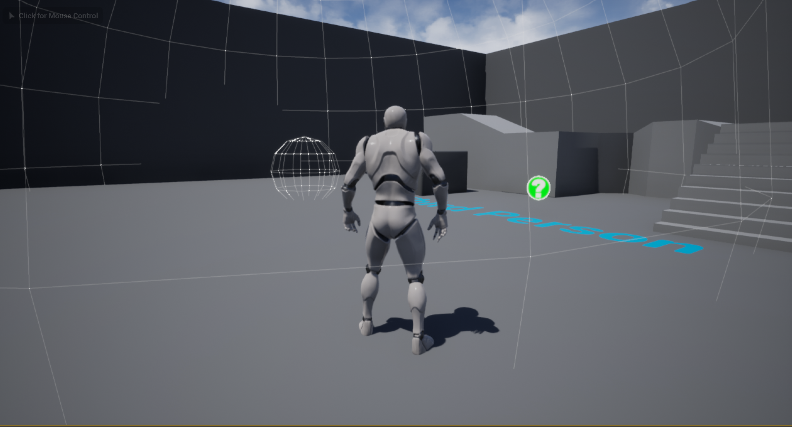

# UnrealSplineAudio
An Unreal  C++ project example of creating a volumetric audio source using splines. 

This C++ project creates a Spline Component and attaches an Audio Component to it, using
the player's position and user-defined range parameter to optimize the tick interval.
 
**Getting Started**
1. Drag in SplineAudio asset from C++ Classes folder
2. Set up sound cue in details panel
3. Set up attenuation 
4. Define tick range and other parameters (set in Spline Audio tab in details panel)

You can also convert this actor into a Blueprint, or check out [my full Blueprint]:
(https://github.com/sgrossm/UnrealSplineAudioBlueprint)
 
For any suggestions or improvements, please email (stevegrossman821@gmail.com).
